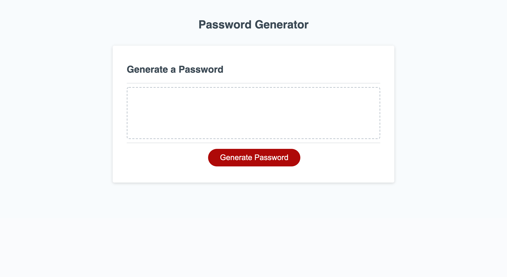

#javascriptPswGen

A password generator created by javascript. This password gen uses prompts with (Y/N) choices on the type of characters you want included
in your password, as well as asking you your desired password length given the parameters of no less then 8 and no more then 128.
if prompts are answered correctly and password length is within given parameters, then your password will be displayed.

Acceptance Criteria:

GIVEN I need a new, secure password

WHEN I click the button to generate a password

THEN I am presented with a series of prompts for password criteria

WHEN prompted for password criteria

THEN I select which criteria to include in the password

WHEN prompted for the length of the password

THEN I choose a length of at least 8 characters and no more than 128 characters

WHEN prompted for character types to include in the password

THEN I choose lowercase, uppercase, numeric, and/or special characters

WHEN I answer each prompt

THEN my input should be validated and at least one character type should be selected

WHEN all prompts are answered

THEN a password is generated that matches the selected criteria

WHEN the password is generated

THEN the password is either displayed in an alert or written to the page

Deployed Site:

https://zi-on.github.io/javascriptPswGen/